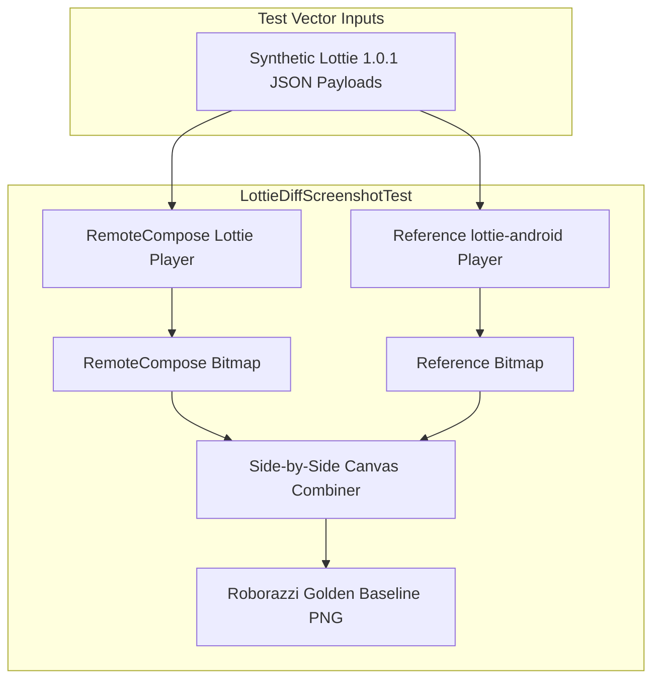

# Concept: Comprehensive Lottie Visual Screenshot Diff Test Suite {#C_LOTTIE_SCREENSHOT_TESTS}

> **Code:** C_LOTTIE_SCREENSHOT_TESTS
> **Status:** active
> **Created:** 2026-08-25
> **Updated:** 2026-08-25
>
> **Depends on:** [`C_FORMAT`](file:///usr/local/google/home/myavorskyi/AndroidStudioProjects/my-horologist-lottie-grandchild-fix-v2/remotecompose/lottie/docs/format.concept.md), [`C_RENDERER`](file:///usr/local/google/home/myavorskyi/AndroidStudioProjects/my-horologist-lottie-grandchild-fix-v2/remotecompose/lottie/docs/renderer.concept.md), [`C_SCREENSHOT_DIFF`](file:///usr/local/google/home/myavorskyi/AndroidStudioProjects/my-horologist-lottie-grandchild-fix-v2/remotecompose/lottie/docs/screenshot_diff.concept.md)
> **Used by:** [`SP_LOTTIE_SCREENSHOT_TESTS`](file:///usr/local/google/home/myavorskyi/AndroidStudioProjects/my-horologist-lottie-grandchild-fix-v2/remotecompose/lottie/docs/screenshot_test_suite.sp.md), [`PL_LOTTIE_SCREENSHOT_TESTS`](file:///usr/local/google/home/myavorskyi/AndroidStudioProjects/my-horologist-lottie-grandchild-fix-v2/remotecompose/lottie/docs/screenshot_test_suite.plan.md)

---

## 1. Intent & Scope

### 1.1 Goal
Establish complete end-to-end visual regression testing across all newly implemented Lottie 1.0.1 rendering capabilities (Phases 1–4) by expanding the Roborazzi screenshot test suite with side-by-side diffs against the `lottie-android` reference player.

### 1.2 What This IS
- Dedicated Roborazzi screenshot diff test cases exercising complex canvas rendering paths:
  1. **Visual Styling & Shaders:** Linear and radial gradient fills/strokes, animated stroke dash patterns, miter limit clipping, and EvenOdd fill rules with self-intersecting geometries.
  2. **Compositing & Masking:** Inverted alpha track mattes (`tt: 2`), non-adjacent `matteParent` hierarchy resolution, and layer mask clipping pipelines (`Add`, `Subtract`, `Intersect`, `Inverted`).
  3. **Advanced Modifiers:** Repeater geometry duplication with affine transform progressions and opacity decay, RoundedCorners on arbitrary Bézier paths, and MergePaths Boolean operations (`Union`, `Subtract`, `Intersect`, `Exclude`).
  4. **Compositions, Assets & Typography:** Multi-level nested precompositions, time remapping (`tm`), Base64 embedded Bitmap ImageLayers, and Vector Typography TextLayers with font glyph rendering, justification, and tracking.
- Automated verification using `./gradlew :remotecompose:lottie:recordRoborazziDebug` and `./gradlew :remotecompose:lottie:verifyRoborazziDebug`.

### 1.3 What This IS NOT
- Unit testing for JSON AST parsing or data class serialization (already comprehensively covered by 267 unit tests).
- Benchmark performance profiling (though visual tests help detect infinite layout/canvas loops).

---

## 2. Architecture & Mechanisms

### 2.1 Test Suites by Feature Domain
1. **`LottieStylingScreenshotTest`**:
   - `gradientLinearAndRadial`: Tests linear & radial gradient fills and strokes with color stops and opacity.
   - `strokeDashAndMiter`: Tests stroke dash patterns with animated offsets and acute miter limits.
   - `evenOddFillRule`: Tests EvenOdd fill rule on overlapping concentric polygons (donut/hole rendering).
   - `primitiveTrimPaths`: Tests TrimPath start/end/offset applied to `rc`, `el`, `sr`, and `sh`.
2. **`LottieCompositingScreenshotTest`**:
   - `invertedAlphaTrackMatte`: Tests `tt: 2` inverted alpha track matte masking.
   - `nonAdjacentMatteParent`: Tests matte layer referencing a non-immediate sibling.
   - `layerMaskClipping`: Tests multi-mask clipping with `Add`, `Subtract`, `Intersect`, and `Inverted` modes.
3. **`LottieModifiersScreenshotTest`**:
   - `repeaterModifier`: Tests Repeater (`rp`) with 5 copies, radial/linear position offset, rotation progression, and opacity falloff.
   - `roundedCornersModifier`: Tests RoundedCorners (`rd`) applied to sharp polygonal star paths.
   - `mergePathsOperations`: Tests MergePaths (`mm`) Boolean operations (`Union`, `Subtract`, `Intersect`, `Exclude`).
4. **`LottieAdvancedFeaturesScreenshotTest`**:
   - `nestedPrecompositions`: Tests 3-level deep sub-composition hierarchy with local timing.
   - `timeRemapping`: Tests precomposition time remapping (`tm`) animating backwards and non-linearly.
   - `bitmapImageLayer`: Tests embedded Base64 image layer decoding, opacity, and aspect-ratio scaling.
   - `vectorTypographyTextLayer`: Tests text layer glyph rendering with Left, Center, and Right justification and tracking.

---

## 3. Design Decisions & Trade-offs

- **Inline Synthetic JSON vs Resource Files:**
  - *Decision:* Use compact, targeted inline JSON strings inside test classes for feature-specific unit screenshot tests, and reserve raw resource files (`res/raw/`) for complex real-world asset animations.
  - *Rationale:* Inline JSON keeps test cases fully self-contained, readable, and independent without polluting the sample resource catalogue with dozens of tiny JSON files.
- **Multi-Frame vs Static Captures:**
  - *Decision:* Capture multi-frame milestones (`0f`, `15f`, `30f`) for time-dependent animations (trim paths, time remapping, position curves), and static frames (`progress = 0.5f`) for static modifier geometries.
  - *Rationale:* Balances test execution time and storage with thorough visual timeline coverage.

---

## 4. Dependencies & Integration Points

- Depends on `:remotecompose:lottie` rendering pipeline (`RenderShapes`, `LottieAnimation`, `ShapeLayer`, `SolidColorLayer`, `PrecompLayer`, `ImageLayer`, `TextLayer`).
- Integrated with Roborazzi Gradle tasks: `:remotecompose:lottie:recordRoborazziDebug` and `:remotecompose:lottie:verifyRoborazziDebug`.
