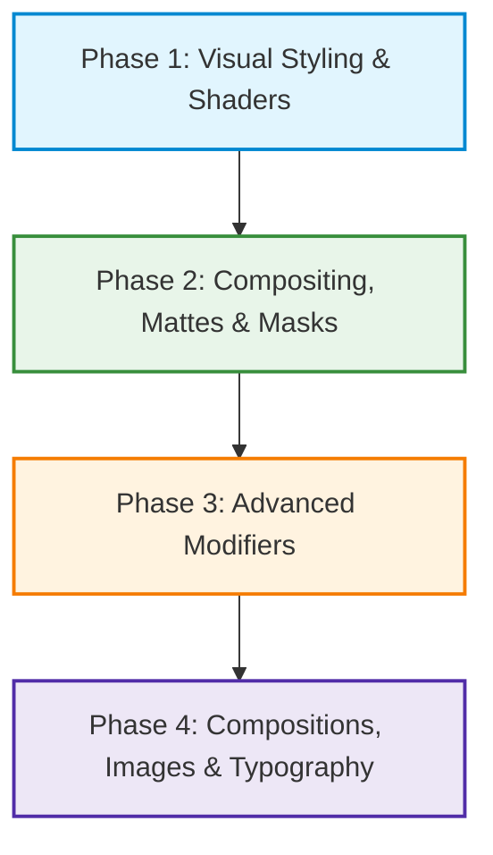

# Implementation Plan: Comprehensive Lottie Visual Screenshot Diff Test Suite {#PL_LOTTIE_SCREENSHOT_TESTS}

> **Code:** PL_LOTTIE_SCREENSHOT_TESTS
> **Status:** in-progress
> **Created:** 2026-08-25
> **Updated:** 2026-08-25
>
> **Depends on:** [`SP_LOTTIE_SCREENSHOT_TESTS`](file:///usr/local/google/home/myavorskyi/AndroidStudioProjects/my-horologist-lottie-grandchild-fix-v2/remotecompose/lottie/docs/screenshot_test_suite.sp.md)
> **Branch:** `lottie-autonomous-improvements`

---

## 1. Overview & Phased Architecture

This plan establishes a comprehensive visual verification test suite utilizing Roborazzi side-by-side diff tests against `lottie-android` reference output across all 19 capabilities implemented in Phases 1–4.

---

## 2. Phase 1: Visual Styling & Shaders

### Task 1.1: Linear & Radial Gradient Shaders Screenshot Test {#PL_LOTTIE_SCREENSHOT_TESTS_T1_1}
- **Objective:** Author Roborazzi screenshot diff tests for Linear Gradient Fill (`gf`), Radial Gradient Fill, and Gradient Stroke (`gs`) with multi-color and opacity stops.
- **Files to Modify:**
  - `remotecompose/lottie/src/test/java/com/google/android/horologist/remotecompose/lottie/LottieFeatureDiffScreenshotTest.kt`
- **Verify:** `./gradlew :remotecompose:lottie:recordRoborazziDebug && ./gradlew :remotecompose:lottie:verifyRoborazziDebug`
- **Commit:** `test(lottie): add screenshot tests for linear and radial gradient shaders`

### Task 1.2: Stroke Dash Patterns, Miter Limits & EvenOdd Fill Rules Screenshot Test {#PL_LOTTIE_SCREENSHOT_TESTS_T1_2}
- **Objective:** Author screenshot diff tests for stroke dash arrays with animated dash offsets, acute miter limits, and EvenOdd fill rules on overlapping concentric polygons.
- **Files to Modify:**
  - `remotecompose/lottie/src/test/java/com/google/android/horologist/remotecompose/lottie/LottieFeatureDiffScreenshotTest.kt`
- **Verify:** `./gradlew :remotecompose:lottie:recordRoborazziDebug && ./gradlew :remotecompose:lottie:verifyRoborazziDebug`
- **Commit:** `test(lottie): add screenshot tests for stroke dashes, miters, and evenodd fill rule`

### Task 1.3: Primitive & Dynamic Shape Trim Paths Screenshot Test {#PL_LOTTIE_SCREENSHOT_TESTS_T1_3}
- **Objective:** Author screenshot diff tests for TrimPath modifiers applied across parametric Rectangles, Ellipses, PolyStars, and Bézier Paths across animation timeline milestones.
- **Files to Modify:**
  - `remotecompose/lottie/src/test/java/com/google/android/horologist/remotecompose/lottie/LottieFeatureDiffScreenshotTest.kt`
- **Verify:** `./gradlew :remotecompose:lottie:recordRoborazziDebug && ./gradlew :remotecompose:lottie:verifyRoborazziDebug`
- **Commit:** `test(lottie): add screenshot tests for primitive and dynamic trim paths`

---

## 3. Phase 2: Compositing, Track Mattes & Layer Masks

### Task 2.1: Inverted Alpha & Non-Adjacent Track Mattes Screenshot Test {#PL_LOTTIE_SCREENSHOT_TESTS_T2_1}
- **Objective:** Author screenshot diff tests for Inverted Alpha track mattes (`tt: 2`) and non-adjacent matte parent layer references (`tp`).
- **Files to Modify:**
  - `remotecompose/lottie/src/test/java/com/google/android/horologist/remotecompose/lottie/LottieFeatureDiffScreenshotTest.kt`
- **Verify:** `./gradlew :remotecompose:lottie:recordRoborazziDebug && ./gradlew :remotecompose:lottie:verifyRoborazziDebug`
- **Commit:** `test(lottie): add screenshot tests for inverted alpha and non-adjacent track mattes`

### Task 2.2: Layer Mask Clipping Pipeline (`masksProperties`) Screenshot Test {#PL_LOTTIE_SCREENSHOT_TESTS_T2_2}
- **Objective:** Author screenshot diff tests for multi-mask layer clipping with `Add`, `Subtract`, and `Intersect` modes on ShapeLayers and SolidColorLayers.
- **Files to Modify:**
  - `remotecompose/lottie/src/test/java/com/google/android/horologist/remotecompose/lottie/LottieFeatureDiffScreenshotTest.kt`
- **Verify:** `./gradlew :remotecompose:lottie:recordRoborazziDebug && ./gradlew :remotecompose:lottie:verifyRoborazziDebug`
- **Commit:** `test(lottie): add screenshot tests for layer mask clipping pipeline`

---

## 4. Phase 3: Advanced Modifiers

### Task 3.1: Repeater Modifier Geometry & Opacity Progression Screenshot Test {#PL_LOTTIE_SCREENSHOT_TESTS_T3_1}
- **Objective:** Author screenshot diff tests for `Repeater` (`rp`) with multiple copies, affine transform progressions (translation, rotation, scale), and start/end opacity decay.
- **Files to Modify:**
  - `remotecompose/lottie/src/test/java/com/google/android/horologist/remotecompose/lottie/LottieFeatureDiffScreenshotTest.kt`
- **Verify:** `./gradlew :remotecompose:lottie:recordRoborazziDebug && ./gradlew :remotecompose:lottie:verifyRoborazziDebug`
- **Commit:** `test(lottie): add screenshot tests for repeater modifier geometry and opacity decay`

### Task 3.2: RoundedCorners & MergePaths Boolean Operations Screenshot Test {#PL_LOTTIE_SCREENSHOT_TESTS_T3_2}
- **Objective:** Author screenshot diff tests for `RoundedCorners` (`rd`) on sharp Bézier stars and `MergePaths` (`mm`) Boolean operations (`Union`, `Subtract`, `Intersect`, `Exclude`).
- **Files to Modify:**
  - `remotecompose/lottie/src/test/java/com/google/android/horologist/remotecompose/lottie/LottieFeatureDiffScreenshotTest.kt`
- **Verify:** `./gradlew :remotecompose:lottie:recordRoborazziDebug && ./gradlew :remotecompose:lottie:verifyRoborazziDebug`
- **Commit:** `test(lottie): add screenshot tests for rounded corners and merge paths boolean operations`

---

## 5. Phase 4: Compositions, Bitmap Images & Typography

### Task 4.1: Deep Nested Precompositions & Time Remapping Screenshot Test {#PL_LOTTIE_SCREENSHOT_TESTS_T4_1}
- **Objective:** Author screenshot diff tests for 3-level deep nested precompositions with local timing stretch and non-linear Time Remapping (`tm`).
- **Files to Modify:**
  - `remotecompose/lottie/src/test/java/com/google/android/horologist/remotecompose/lottie/LottieFeatureDiffScreenshotTest.kt`
- **Verify:** `./gradlew :remotecompose:lottie:recordRoborazziDebug && ./gradlew :remotecompose:lottie:verifyRoborazziDebug`
- **Commit:** `test(lottie): add screenshot tests for nested precomps and time remapping`

### Task 4.2: Bitmap ImageLayer & Vector Typography TextLayer Screenshot Test {#PL_LOTTIE_SCREENSHOT_TESTS_T4_2}
- **Objective:** Author screenshot diff tests for Base64 embedded Bitmap `ImageLayer` rendering and vector typography `TextLayer` font glyph rendering with justification and tracking.
- **Files to Modify:**
  - `remotecompose/lottie/src/test/java/com/google/android/horologist/remotecompose/lottie/LottieFeatureDiffScreenshotTest.kt`
- **Verify:** `./gradlew :remotecompose:lottie:recordRoborazziDebug && ./gradlew :remotecompose:lottie:verifyRoborazziDebug`
- **Commit:** `test(lottie): add screenshot tests for bitmap image layer and vector typography text layer`
